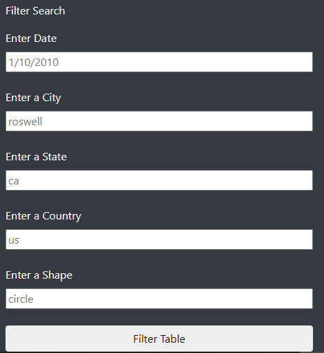

# UFOs

## Overview of Project: 
To filter through UFO sightings with javascript. We creayed an HTML webpage that can hold all the information gathered. The HTML page can find results using multiple filters added.

## Results: 
Dana can use the search criterias listed in the HTML to select her specific UFO sightings.
She can use one filter criteria such as the date to find UFO sightings reported on that specific date.
She can also filter by city and search for all the UFO sightings reported in that specific city.
Lastly, she can have multiple search filters such as date and city or country for a more selective search

## Summary: 
There is not much details to what the filter "shape" alludes to. It also does not give an instance of what shapes are avaialble. The user would need to know that this pertains to the shape of the UFO and know there may be more than just a circular shape available. The dataset is also limited to just 3 days span.
For further development, the data should be updated to include more recent sightings.
